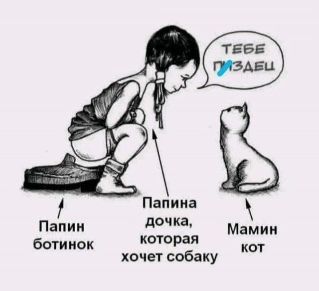

# Инструкция по работе с Markdown

Это обычный текст. Text in english
Это обычный текст. Добавили еще строку

Продолжение обычного текста

добавили текст через браузер

## Списки

* один
* два
* три

4. четыре
5. пять
6. шесть

## Картинки

Это апельсин
